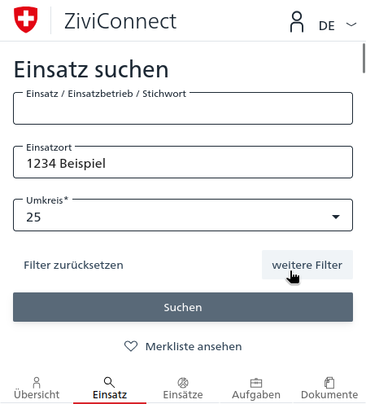
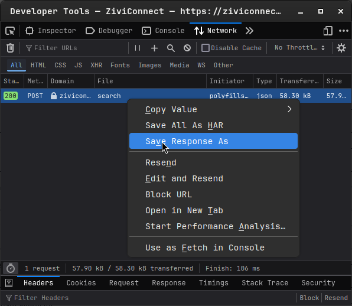
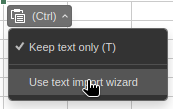
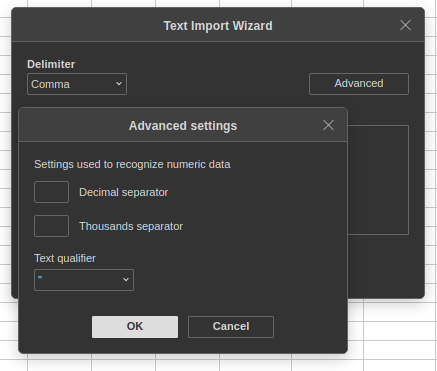

Eine bessere User Experience für ZiviConnect 

## Was ist das?
Die Nutzeroberfläche des offiziellen Portals des Schweizer Zivieldienst "ZiviConnect" ist fehlerbehaftet und unübersichtlich. Dieses Projekt enthält Werkzeuge, die bei der Verwendung von ZiviConnect helfen und die Benutzererfahrung verbessern sollen.

## Funktionen
- **Einsatzsuche**: Eine Tabelle mit allen relevanten Informationen zu einzelnen Pflichtenheftern auf einen Blick.
- **Kontaktliste**: Automatische Extraktion der Kontaktdaten aus Pflichtenheftern.
- **JSON Schema für Pflichtenhefter**: Ein Schema, das die Struktur von Pflichtenheftern definiert, wie sie von der API kommen.

## Verwendung
### Einsatzsuche
1. Die [ZiviConnect Einsatzsuche](https://ziviconnect.admin.ch/zdp/einsatz) öffnen

2. Beliebige Filter setzen (siehe den Button rechts unter den Hauptfiltern `weitere Filter`)

3. Mit `f12` oder `Strg` + `Shift` + `I` die Entwicklerwerkzeuge öffnen

4. Den Tab `Netzwerk` auswählen

5. Auf der Webseite auf `Suchen` klicken

6. In den Entwicklerwerkzeugen den Ersten Eintrag via Rechtsklick-Menü herunterladen

7. Die Datei zu `CSV` konvertieren, zum Beispiel mit [ConvertCSV](https://www.convertcsv.com/json-to-csv.htm)

8. Das Resultat in der [Excel Tabelle](Einsatzsuche.xlsx) im Arbeitsblatt `Suchresultate` einfügen

9. Möglicherweise muss der Import der Daten konfiguriert werden. Hierbei als Trennzeichen das Komma `,` und als Texttrennzeichen das Anführungszeichen `"` verwenden.

 

#### Optional: Zusatzinformationen aus Pflichtenheftern

10. Einzelnes Pflichtenheft öffnen

11. Schritte 3 - 4

12. Mit `f5` oder `Strg` + `R` die Seite neu laden

13. In den Entwicklerwerkzeugen den Eintrag mit vom Typ `json` mit der Pflichtenheftnummer als Dateiname via Rechtsklick-Menü herunterladen

14. Die Datei in einem Ordner speichern

15. Schritte 10 - 15 für alle Pflichtenhefte wiederholen

16. Die Dateien mit dem Python Skript [pflichtenheft_parser.py](pflichtenheft_parser.py) einlesen

17. Das Resultat in der [Excel Tabelle](Einsatzsuche.xlsx) im Arbeitsblatt `Pflichtenhefte` einfügen, in der Reihenfolge der Suchresultate.
